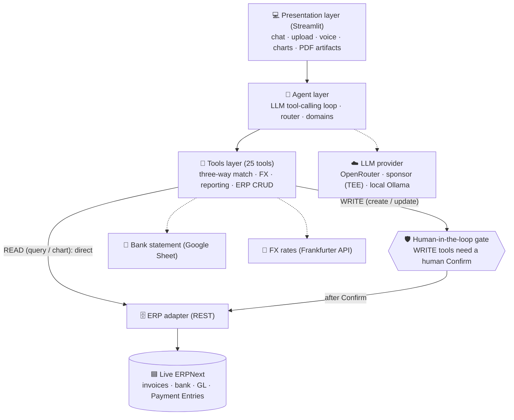
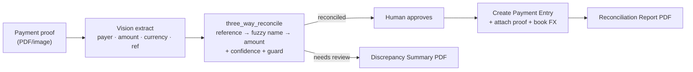

# 💱 Global Treasury Agent - TeamName

**An agentic AI assistant that reconciles cross-border payments end-to-end — on a live ERPNext.**

You drop in payment proofs (PDF / image, any currency); for each one the agent **extracts** the data, performs a **three-way match** (payment proof ↔ ERPNext invoice ↔ bank statement) with a confidence score, lets **you approve**, then **posts** the Payment Entry, books the **FX gain/loss**, and generates a downloadable **Reconciliation Report**. When something doesn't add up, it produces a **Discrepancy Summary** explaining why.

---

## 📌 Notes for Reviewers (please read first)

> **1. The ERPNext backend runs on my personal home-lab Linux server**, exposed to the internet through a **Cloudflare tunnel** (the `*.trycloudflare.com` URL in `config.py`).
> These tunnel URLs are temporary and may go down. **If the app errors on any ERPNext call, or the login page of ERPNext won't load, the tunnel is probably down — please contact me and I'll bring it back up / send a fresh URL:**
> **`[ cqyyy1018@gmail.com/ Discord: cqybalala ]`**
>
> **2. Please use the “Qwen3-VL 32B · OpenRouter” model** (it is already the default in the sidebar 🧠 **Model** picker).
> It is the fastest and most reliable option. The other options are slower (TEE/confidential-compute sponsor model) or only reachable on my LAN (local Ollama), so **stick with OpenRouter for the smoothest experience.**
>
> **3. You will need ERPNext login credentials** to enter the app (Username: accountant@gmail.com, Password: Admin-123).

---


## 🏗️ Architecture



**Per-payment reconciliation flow:**



---

## ✅ System Requirements

| | |
|---|---|
| **OS** | Windows / macOS / Linux |
| **Python** | 3.10+ (developed on 3.13) |
| **Network** | Internet access (ERPNext via Cloudflare tunnel, LLM API, FX API, Google Sheets) |
| **ERPNext** | A reachable ERPNext site + API key/secret (provided in `config.py`) |
| **LLM** | An OpenAI-compatible endpoint (OpenRouter key provided) |

### Dependencies
Installed via `requirements.txt`:

- `streamlit` — web UI
- `openai` — OpenAI-compatible LLM client
- `httpx` — HTTP calls (ERPNext REST, FX, bank sheet)
- `pandas`, `plotly` — tables & charts
- `PyMuPDF` (`fitz`) — PDF rendering of proofs + report generation

---

## 🚀 Setup & Run

> 📹 **Setup walkthrough video** (not a demo — step-by-step install guide): [Watch on Google Drive](https://drive.google.com/file/d/12or4vm2sXoMYlLmf4B3pfdYYWPPClHS_/view?usp=sharing)

### 1. Install dependencies
```bash
# (recommended) create a virtual environment
python -m venv .venv
```

**Windows** (PowerShell — run this once if activation is blocked):
```powershell
Set-ExecutionPolicy -ExecutionPolicy RemoteSigned -Scope CurrentUser
.venv\Scripts\activate
```

**macOS/Linux:**
```bash
source .venv/bin/activate
```

Then install packages:
```bash
pip install -r requirements.txt
```

### 2. Set up API keys

Copy the example env file and fill in your API keys:
```bash
cp .env.example .env
```

Edit `.env`:
```
OPENROUTER_API_KEY=your_key_here
CHUTES_API_KEY=your_key_here
```

> Need the keys? Contact **cqyyy1018@gmail.com** or **Discord: cqybalala** and I'll provide them promptly.

### 3. Configure

All other settings (ERPNext URL, credentials, company, bank statement) are already set in **`config.py`** — no changes needed.

> 🔐 **Credentials (for reviewers)**:
>
> | Item | Value |
> |---|---|
> | ERPNext URL | `https://deluxe-obj-minnesota-hardcover.trycloudflare.com` |
> | ERPNext login | **Username:** `accountant@gmail.com` · **Password:** `Admin-123` |
> | ERPNext API key | `8203688a6f18fa4` |
> | ERPNext API secret | `9b34ec3b96f507e` |
> | Company | `Penang Components Sdn Bhd` |
> | Bank statement (Google Sheet) | `https://docs.google.com/spreadsheets/d/1gTz-uJPGNDNkhP_rtZMWUfVO_duphO3lqnAInOgG8ys/edit?usp=sharing` |

### 4. Run
```bash
streamlit run app.py
```

### 5. Select a model

In the sidebar **Model** picker:
- **”Qwen3-VL 32B · OpenRouter”** ← recommended (fast, most stable, best tested)
- **”Qwen3.6-27B · Chutes (sponsor)”** ← available but not well-tested; may be slower or less reliable

### 6. Log in to ERPNext

When the app opens at **http://localhost:8501**, sign in with:
- **Username:** `accountant@gmail.com`
- **Password:** `Admin-123`

---

## 🎬 How to Demo

1. **Sidebar → Bank Statement:** confirm the Google Sheet URL and the **Month tab** (e.g. `May2026`).
2. **Upload a payment proof** (PDF/image) and click **Start**.
3. Watch the agent **extract → match → show a confidence score**.
4. Click **Confirm** on the approval card → a **Payment Entry** is created in ERPNext and a **Reconciliation Report PDF** appears.
5. Upload a proof that doesn’t match → get a **Discrepancy Summary PDF**.
6. Try these **analytics prompts** in chat:

| Prompt | What you get |
|---|---|
| `show me this week’s forex loss` | Bar chart of FX gain/loss by day |
| `show me this month’s forex loss` | Monthly FX summary chart |
| `list overdue invoices` | Table of unpaid invoices past due date |
| `show me all sales invoices this month` | Sales invoice table |
| `what is our total accounts receivable` | AR summary |
| `show purchase orders this month` | Procurement overview |

> 🧪 **Sample payment proofs** for testing are included in the `samples/` folder:
> - `GoodTransaction.png` — SGD 774.00 from NVIDIA SINGAPORE (should reconcile ✅)
> - `WrongTransaction.png` — USD 203.52, mismatched details (should produce a Discrepancy Summary ⚠️)

---

## 🧩 Features

- **Multi-currency payment-proof extraction** (vision model)
- **Three-way reconciliation** (proof ↔ invoice ↔ bank) with confidence + a false-match guard
- **Date-accurate FX conversion**; realized **FX gain/loss** read back from the ledger
- **Human-in-the-loop approval** before any write to ERPNext
- **Auto-generated PDF artifacts**: Reconciliation Report & Discrepancy Summary
- **Treasury analytics & charts** (forex loss over time, AR/AP, custom)
- **Selectable LLM** (OpenRouter / sponsor TEE / local Ollama) via the sidebar
- **Voice input** & persistent multi-session chat history

---

## 🗂️ Project Structure

```
app.py                 Streamlit UI (presentation + HITL gate + PDF rendering)
agent.py               LLM adapter + tool-calling loop (+ CLI)
router.py              Routes a query to the right domain agent
domains.py             Domain configs: tools + system prompts
tools.py               Tool schemas + execute_tool() dispatcher
erpnext_client.py      ERPAdapter (abstract) + ERPNextAdapter (REST)
invoice_extractor.py   Vision extraction of proofs/invoices
bank_statement_parser.py  Google-Sheet / CSV bank statement parser
forex.py               FX rates (Frankfurter)
auth.py · db.py        ERPNext login · SQLite chat history
config.py              All settings
api_server.py          Optional: REST API / ERPNext sidebar
```

---

## 🛠️ Troubleshooting

| Symptom | Likely cause / fix |
|---|---|
| Login page won't load / ERPNext errors | **Cloudflare tunnel is down** → contact me for a fresh URL |
| Slow responses | You're on the **TEE sponsor model** → switch the sidebar picker to **OpenRouter** |
| `ModuleNotFoundError` | Re-run `pip install -r requirements.txt` inside your virtual env |
| “Field not permitted in query” | Harmless — the agent will retry with the correct field |
